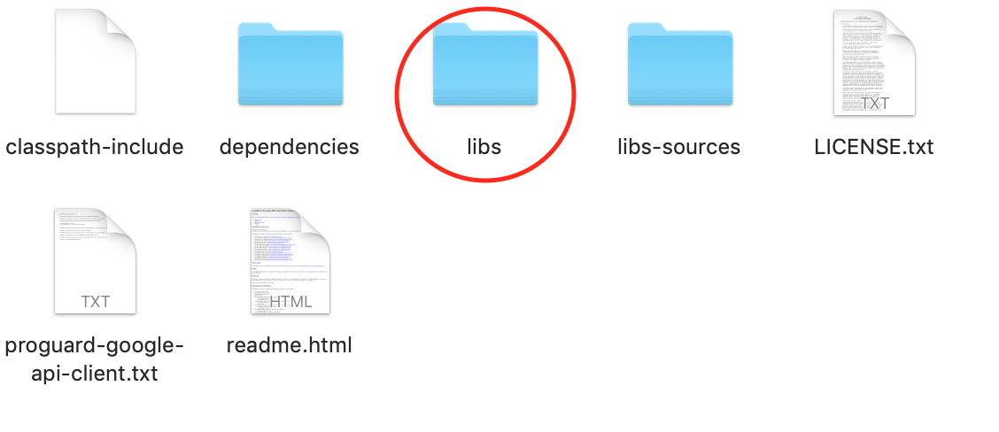
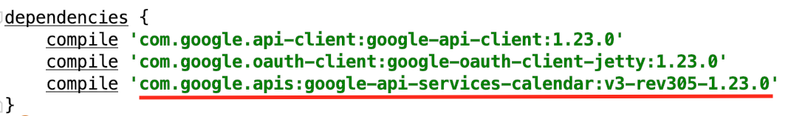
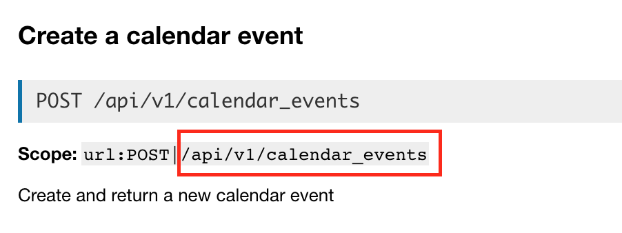

# 20PercentProject
# 20Project
## File Explanation
Everything out of the src is either gradle setup or part of the initial set up. I did not code anything in them. 

The file in the src is called **CalendarQuickStart.java**. Inside is the progress that I have made with the Google Calendar API. Anyone that pulls from this repository is able to have a set up code that they could make further developments on.

## Google Calendar Set Up:
URL: https://developers.google.com/calendar/quickstart/java
      
   This is the link to the tutorial that helps you set up the inital set up for the Google Calendar API.
**Notes:**
* When you are going through the steps form the tuortial, gradele set up requires Homebrew. This is the link to get [homebrew](https://docs.brew.sh/Installation)
* You can upload the setup into InteliJ, and when you paste your starter code into a .java, gradle doesn't import any of the libriaries so many parts of your code will be red with errors. To fix this problem you will need to download the google-api-java-client folder online. You can find this folder simply by looking it up. The file actually has a lot of unnecessary files. The only folder you will need called **libs** 
  
* Go to **File** --> **Project Structure** in java and add libs into the libraries. 
* This should get rid of most of the red imports, execpt for **.services**. In order to get rid of all of the red, you cand go into your `build.gradle` file and copy the following name under descrepencies. This is a link that you can use to download the library for [services](https://mvnrepository.com/artifact/com.google.apis/google-api-services-calendar/v3-rev305-1.23.0). 

## Using Canvas API:
URL: https://canvas.instructure.com/doc/api/courses.html
   
   This is the link to the Canvas API page, this can act as a guide when implementing  
  
**Postman:**
   Postman is an API development software that can facilitate this process  
   URL: https://www.getpostman.com/apps  
   Use this link to download Postman  

**Steps:**
  1. Open Postman and create a Request by clicking the "New" tab in the uper left corner. Name your request "Create Calendar Event".
  2. Right under your "Creat Calendar Event", the default choice should be GET. Click the dropdown menu and change it to **POST**. 
  3. In the "Enter request URL" field right next to POST, first paste https://kentdenver.instructure.com and then go to the Canvas API          link above and scrol down to **Create a calendar event** under **Calendar Events**. You will see **scope url**, copy and paste the        folowing section on to the end of .com
  
  
  
  4. Click the subtab "Authorization" and under "Type" choose "Bearer Token". You won't need to do anything with it becuase Postman will        automatically fill in the Authroization for you.
  5. Click on the **Header** subtab and under Key, type `Content_Type` and assign Values to `application/x-www-form-urlencoded`
  6. Now go to text subtab, Body, and in the first line click "application/x-www-form-urlencoded"
  7. Go back to Canvas API and copy the required parameter into the **Key**. The only required perameter is `calendar_event[context_code]`      and the corresonding Value is the access token to your Canvas Calender. Every student has their unique ID, so you may ask the teacher      for yours. 
  8. You may add more parameters to your body, but it is not required. Parameters like "title" and "star_at", "end_at" are recommended. 
  9. For the Values of "star_at" and "end_at", the date and time needs to follow a specific format (yyyy-mm-ddThh:mm:ss). And note that it      is military time. 
